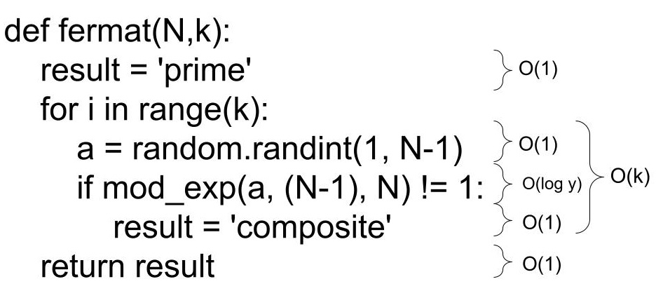
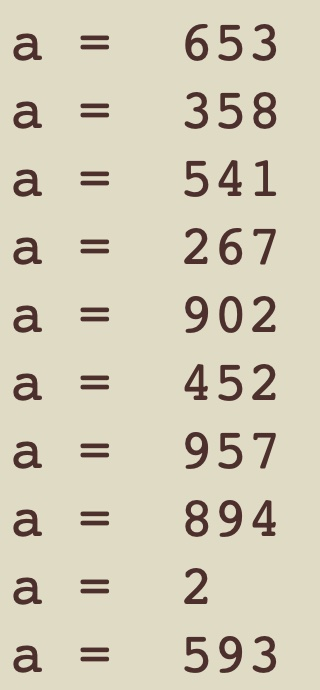

# Project 1

Using Fermat's Little Theorem and the Miller-Rabin test to determine if a number is prime

## 1 - Code

- [x] Show all of the code that you wrote.

```
import random

# This is main function that is connected to the Test button. You don't need to touch it.
def prime_test(N, k):
    return fermat(N,k), miller_rabin(N,k)

# You will need to implement this function and change the return value.
def mod_exp(x, y, N):
    if y == 0:
        return 1
    z = mod_exp(x, (y//2), N)
    if y % 2 == 0:
        return (z**2 % N)
    else:
        return (x*(z**2)) % N

# You will need to implement this function and change the return value.  
def fprobability(k):
    error = 1.0
    for _ in range(1, k+1):
        error = error/2
    return 1-error

# You will need to implement this function and change the return value.  
def mprobability(k):
    error = 1.0
    for _ in range(1, k+1):
        error = error/4
    return 1-error

# You will need to implement this function and change the return value, which should be
# either 'prime' or 'composite'.
#
# To generate random values for a, you will most likley want to use
# random.randint(low,hi) which gives a random integer between low and
# hi, inclusive.
def fermat(N,k):
    result = 'prime'
    for i in range(k):
        a = random.randint(1, N-1)
        if mod_exp(a, (N-1), N) != 1:
            result = 'composite'
    return result

# You will need to implement this function and change the return value, which should be
# either 'prime' or 'composite'.
#
# To generate random values for a, you will most likley want to use
# random.randint(low,hi) which gives a random integer between low and
#  hi, inclusive.
def miller_rabin(N, k):
    a = random.randint(2, N-2)  
    
    def helper(N, k, d, r, a):
        if k == 0:
            return 'prime'
        
        
        mod_exp_result = mod_exp(a, d, N)
        print(f"Calculation: {a}^{d} = {mod_exp_result} mod ({N})")
        
        if mod_exp_result == 1 or mod_exp_result == N - 1:
            return 'prime'
        
        
        for _ in range(r):
            mod_exp_result = (mod_exp_result * mod_exp_result) % N
            print(f"Calculation: {a}^{(2**(_+1)) * d} = {mod_exp_result} mod ({N})")
            if mod_exp_result == N - 1:
                return 'prime'
            elif mod_exp_result == 1:
                return 'composite'
        
        return 'composite'

    
    d = N - 1
    r = 0
    while d % 2 == 0:
        d //= 2
        r += 1
    
    return helper(N, k, d, r, a)
```

## 2 - Complexity

- [x] Discuss the time and space complexity of the Modexp and Fermat algorithms.

Both the time and space complexity of mod_exp is O(log (y)). 

The time complexity of fermat is O(k log (y) ) as it calls mod_exp k number of times, and the space complexity is constant as the space required by the function does not change as its input increases. 

See diagrams below.

### mod_exp Complexity


### fermat Complexity



## 3 - Example Screenshot

- [x] At least one screenshot of your application with a working example.

The following is an example of both methods working correctly


## 4 - Algorithmic Errors and Differences

- [x] A brief discussion of some experimentation you did to identify inputs for which the two algorithms disagree.

The fermat function is more likely to incorrectly qualify a charmichael number as valid. This is because a Carmichael number n passes Fermat’s primality test for any base b relatively prime to n. We can demonstrate this by passing in 1105, the second smallest charmichael number. After running the first time, we get the correct result from both functions.


However, if we run it a few more times, we will get a difference in results.


This is because the most recent time we ran it, it happened to choose 10 bases which were all relatively prime to 1105 resulting in an incorrect evaultion. The following are all 10 bases it chose.



The solution to minimizing this error is to increase k, the number of times it loops, so that the chances of it choosing all relatively prime numbers is smaller.

## 5 - Probabilities of Correctness

- [x] Discuss the two equations you used to compute the probabilities 𝑝 of correctness for the two algorithms

### Probability of Fermat's Little Theorem

```
# You will need to implement this function and change the return value.  
def fprobability(k):
    error = 1.0
    for _ in range(1, k+1):
        error = error/2
    return 1-error
```

### Probability of the Miller-Rabin Test

```
# You will need to implement this function and change the return value.  
def mprobability(k):
    error = 1.0
    for _ in range(1, k+1):
        error = error/4
    return 1-error
```

