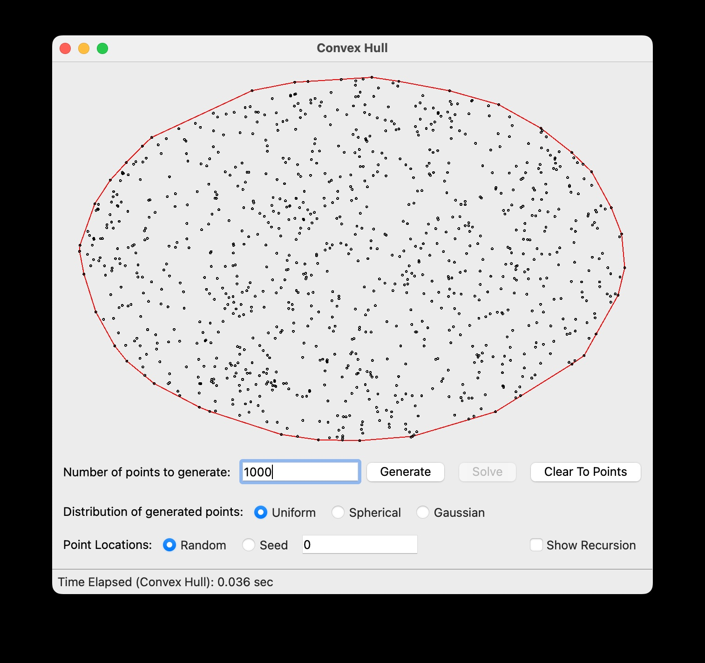

# Convex Hull

## 1 - Code
- [x] Correct functioning code to solve the Convex Hull problem using the nlogn divide and conquer algorithm presented in class, with appropriate comments.

```
import math

from which_pyqt import PYQT_VER
if PYQT_VER == 'PYQT5':
	from PyQt5.QtCore import QLineF, QPointF, QObject
elif PYQT_VER == 'PYQT4':
	from PyQt4.QtCore import QLineF, QPointF, QObject
elif PYQT_VER == 'PYQT6':
	from PyQt6.QtCore import QLineF, QPointF, QObject
else:
	raise Exception('Unsupported Version of PyQt: {}'.format(PYQT_VER))


import time

# Some global color constants that might be useful
RED = (255,0,0)
GREEN = (0,255,0)
BLUE = (0,0,255)

# Global variable that controls the speed of the recursion automation, in seconds
PAUSE = 0.25

#
# This is the class you have to complete.
#
class ConvexHullSolver(QObject):

# Class constructor
	def __init__( self):
		super().__init__()
		self.pause = False
	
	# Some helper methods that make calls to the GUI, allowing us to send updates
	# to be displayed.
	
	def showTangent(self, line, color):
		self.view.addLines(line,color)
		if self.pause:
			time.sleep(PAUSE)
	
	def eraseTangent(self, line):
		self.view.clearLines(line)
	
	def blinkTangent(self,line,color):
		self.showTangent(line,color)
		self.eraseTangent(line)
	
	def showHull(self, polygon, color):
		self.view.addLines(polygon,color)
		if self.pause:
			time.sleep(PAUSE)
	
	def eraseHull(self,polygon):
		self.view.clearLines(polygon)
	
	def showText(self,text):
		self.view.displayStatusText(text)

	# thhis sorts the points clockwise starting at 270 degrees
	def sort_points_clockwise(self, points):
		# Calculate the centroid (average point)
		centroid_x = sum(point.x() for point in points) / len(points)
		centroid_y = sum(point.y() for point in points) / len(points)

		# Calculate angles relative to the centroid, adjusting for clockwise starting from directly down
		def calculate_angle(point):
			angle = math.atan2(point.y() - centroid_y, point.x() - centroid_x)
			# Adjust angles to start from directly down (0 degrees)
			adjusted_angle = (angle + math.pi/2) % (2 * math.pi)
			return adjusted_angle

		# Sort points by angles in descending order
		sorted_points = sorted(points, key=calculate_angle, reverse=True)

		return sorted_points

		
	class Line:
		
		def __init__(self, pt1, pt2):
			
			if pt1.x() < pt2.x():
				self.leftPoint = pt1
				self.rightPoint = pt2
			else:
				self.leftPoint = pt2
				self.rightPoint = pt1

			self.slope = self.calculate_slope()
			self.intercept = self.calculate_intercept()
			
		# this finds the slope between the two points
		def calculate_slope(self):
			return (self.rightPoint.y() - self.leftPoint.y()) / (self.rightPoint.x() - self.leftPoint.x())
			
		# function to find the y-intercept of a line	
		def calculate_intercept(self):
			return self.leftPoint.y() - (self.slope * self.leftPoint.x())
			
		# this returns the y value on the line using the x value of the point you want to compare to the line
		def findPointOnLine(self, differentHullPoint):
			return (self.slope * differentHullPoint.x()) + self.intercept
		
		# this returns if a point is below the line or above the line. Points should never be equal.
		def isPointBelowLine(self, differentHullPoint):
			if self.findPointOnLine(differentHullPoint) < differentHullPoint.y():
				return False
			# this is false if the point is higher than the point on the line at value x
			elif self.findPointOnLine(differentHullPoint) > differentHullPoint.y():
				return True
			else:
				print("Points were equal!!! Error!")
	
	# This function merges two different hulls and returns a list of all the points in the greater hull.
	def mergeHulls(self, hullL, hullR):
		
		######################
		##find upper tangent##
		######################
		

		# this suggests that each hull is sorted 
		rightAnchor = hullR[0]
		leftAnchor = hullL[len(hullL) - 1]
		
		#this gives the slope of the line between the two points
		currentUpperTan = self.Line(leftAnchor, rightAnchor)
		upperTanFound = False
		
		while upperTanFound == False:
			upperTanFound = True
			rightAnchorMoved = False
			# move up left hull
			for i in range(-2, -len(hullL)-2, -1):
				i = i % len(hullL)
				if hullL[i] == leftAnchor:
					continue

				if upperTanFound == False and currentUpperTan.isPointBelowLine(hullL[i]) == True:
					break

				if currentUpperTan.isPointBelowLine(hullL[i]) == False:
					
					leftAnchor = hullL[i]
					currentUpperTan = self.Line(leftAnchor, rightAnchor)
					upperTanFound = False  
			
			# move up right hull
			for j in range(len(hullR)):
				
				if hullR[j] == rightAnchor:
					continue
				
				if rightAnchorMoved == True and currentUpperTan.isPointBelowLine(hullR[j]) == True:
					break

				if currentUpperTan.isPointBelowLine(hullR[j]) == False:
					
					rightAnchor = hullR[j]

					currentUpperTan = self.Line(leftAnchor, rightAnchor)
					upperTanFound = False  
					rightAnchorMoved = True
					
			# Upper tangent found at this point
	
		######################
		##find lower tangent##
		######################
	

		# this suggests that each hull is sorted 
		rightAnchor = hullR[0]
		leftAnchor = hullL[len(hullL) - 1]
		
		#this gives the slope of the line between the two points
		currentLowerTan = self.Line(leftAnchor, rightAnchor)
		lowerTanFound = False
		
		while lowerTanFound == False:
			lowerTanFound = True
			rightAnchorMoved = False
			
			# move up left hull
			for i in range(len(hullL)):
				if hullL[i] == leftAnchor:
					continue

				if lowerTanFound == False and currentLowerTan.isPointBelowLine(hullL[i]) == False:
					break
	  
				if currentLowerTan.isPointBelowLine(hullL[i]) == True:
					
					leftAnchor = hullL[i]
					currentLowerTan = self.Line(leftAnchor, rightAnchor)
					lowerTanFound = False  
			
			# move up right hull
			for j in range(-1, -len(hullL)-1, -1):
				j = j % len(hullR)
			# for j in range(len(hullR)):
				if hullR[j] == rightAnchor:
					continue

				if rightAnchorMoved == True and currentLowerTan.isPointBelowLine(hullR[j]) == False:
					break
	  
				if currentLowerTan.isPointBelowLine(hullR[j]) == True:
					
					rightAnchor = hullR[j]
					currentLowerTan = self.Line(leftAnchor, rightAnchor)
					lowerTanFound = False  
					rightAnchorMoved = True
			
			# Lower tangent found at this point

		######################
		##  MERGE THE HULL  ##
		######################
					
		mergedHull = []

		# Add points from left hull from lower tangent to upper tangent
		i = hullL.index(currentLowerTan.leftPoint)
		while True:
			mergedHull.append(hullL[i])
			if hullL[i] == currentUpperTan.leftPoint:
				break
			i = (i + 1) % len(hullL)

		# Add points from right hull from upper tangent to lower tangent
		j = hullR.index(currentUpperTan.rightPoint)
		while True:
			mergedHull.append(hullR[j])
			if hullR[j] == currentLowerTan.rightPoint:
				break
			j = (j + 1) % len(hullR)

		# We want to return a list of all the points in the convex hull in clockwise order.
		return mergedHull
	
		
	#This is my Divide and Conquer algorithm to solve the Convex Hull problem
	# points is a list of qpointf points. 
	def DCHull(self, points):
		
		#base case. if there are less than three points, then all of them are in its own hull. 
		if len(points) <= 3:
			return self.sort_points_clockwise(points)
	
		middleIndex = len(points) // 2
		
		hullL = self.DCHull(points[:middleIndex])
		hullR = self.DCHull(points[middleIndex:])
		
		return self.mergeHulls(hullL, hullR)
	

	
	# This is the method that gets called by the GUI and actually executes
	# the finding of the hull
	def compute_hull( self, points, pause, view):
		self.pause = pause
		self.view = view
		assert( type(points) == list and type(points[0]) == QPointF )
	
		t1 = time.time()

		# sort the points
		sortedPoints = sorted(points, key=lambda point: point.x())

		t2 = time.time()
	
		t3 = time.time()
		
		############################################## MY CODE #############################
		
		listOfHullPoints = self.DCHull(sortedPoints)
		polygon = [QLineF(listOfHullPoints[i], listOfHullPoints[(i+1) % len(listOfHullPoints) ] ) for i in range(len(listOfHullPoints))]
		
		############################################## MY CODE #############################

		t4 = time.time()
	
	# when passing lines to the display, pass a list of QLineF objects.  Each QLineF
	# object can be created with two QPointF objects corresponding to the endpoints
		self.showHull(polygon,RED)
		self.showText('Time Elapsed (Convex Hull): {:3.3f} sec'.format(t4-t3))
```

## 2 - Time and Space Complexity
- [x] Discuss the time and space complexity of your algorithm.

### Time Complexity

The main call to DCHull() in compute_hull() calls several subfunctions and can be divded into three basic parts. The first part is the DCHull() function itself which uses a divde and conquer approach with a time complexity of at most O(log n).


At the end of the DCHull() Function, it calls mergeHulls(), which we will now show has at most a O(n) time complexity. If mergeHulls() has a O(n) time complexity, then our overall time complexity would be O(log n) * O(n)  or O(n log n) as each recursive call calls mergeHulls() (with O(n)) log n times resulting in a O(n log n) time complexity.

mergeHulls() has 2 main parts, which in turn are made up of a single logical block repeated twice for both the left and right hulls. In the first part, we find the upper and lower tangents to the left and right hulls. Every time the line between the two hulls moves, it gets closer and closer to the top of the hull. Becuase there is a finite distance between the starting point and the point of the upper tangent, both loops are at most O(2n) or O(n), making this entire logical block O(n). The side says the while loop is O(n/2) to show that as one side increments higher the other side also progresses to the final tangent point. This entire block is then repeated again to find the lower tangent, and it has the same time complexity. 


The last block shows the time it takes to merge the two hulls together. The loop we take to merge the two hulls starts at the lower tangent on the left and increments to the upper tangent. The max that this loop could be is less than n times, and would offset the amount of times the other hull has to loop to find the outer points as well. The overall time complexity of this section is also O(n)


#### Recurrence Relation and the Master Theorem

Now, to find the Recurrence Relation

### Space Complexity

i think this is just O(n)

## 3 - Experimental Outcomes

| Values     | Set 1      | Set 2      | Set 3      | Set 4      |  Set 5     |  Mean Time |
|------------|------------|------------|------------|------------|------------|------------|
| 10         |  0.000 |  0.001 |  0.000 |  0.000 |  0.000 |  0.000 Sec |
| 100        |  0.005 |  0.004 |  0.005 |  0.005 |  0.005 |  0.005 Sec |
| 1000       |  0.035 |  0.036 |  0.037 |  0.036 |  0.035 |  0.035 Sec |
| 10000      |  0.186 |  0.183 |  0.182 |  0.186 |  0.183 |  0.184 Sec |
| 100000     |  1.770 |  1.753 |  1.743 |  1.721 |  1.702 |  1.738 Sec |
| 500000     | 10.395 | 10.749 | 11.089 | 10.308 | 10.974 | 10.703 Sec |
| 1000000    | 22.684 | 21.107 | 21.740 | 20.328 | 21.524 | 21.476 Sec |


## 4 - Differences between theoretical and empirical analyses

## 5 - Examples



