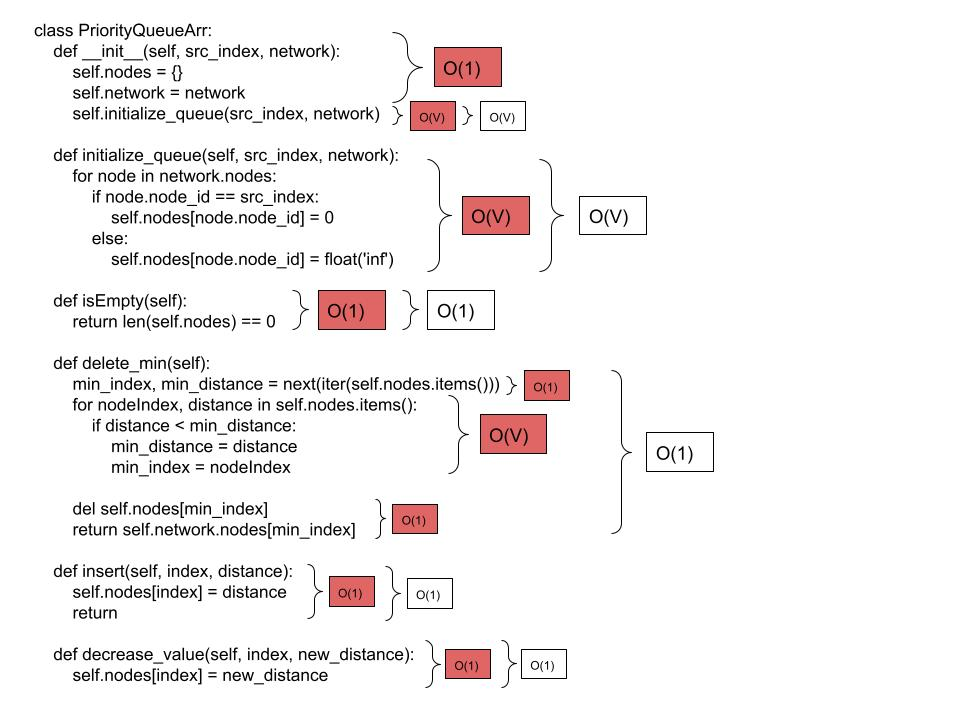
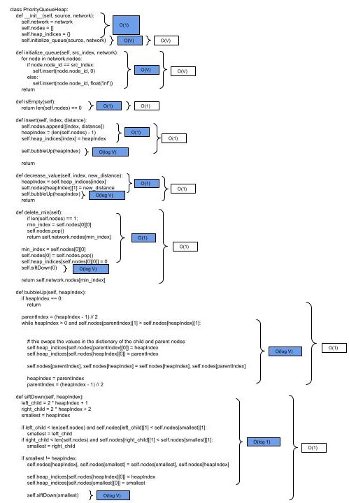
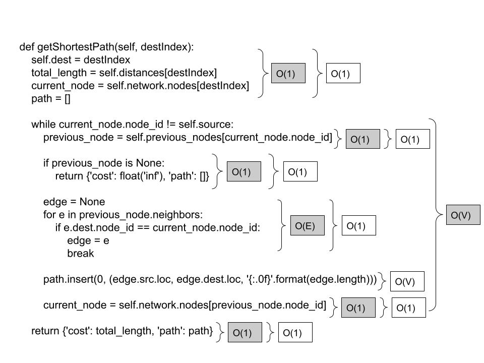

# Network Routing (Dijkstra's Algorithm)

## 1 - Dijkstra's Algorithm
- [x] Correctly implement Dijkstra’s algorithm

```
    def computeShortestPaths(self, srcIndex, use_heap=False):
        # Time Complexity O((V +E) log V) - if you are using a heap. if you are using an array,
        # it would be O(V^2 + E) because of delete_min. because E is always 3, it is essentially
        # O(n Log n) for a heap implementation

        # Space Complexity O(n) -  you have to store all the nodes

        self.source = srcIndex
        t1 = time.time()
     
        self.distances = {}
        self.previous_nodes = {}
        
        ##########################
        ## Dijkstra's Algorithm ##
        ##########################
        
        # Initialize distances and previous node arrays
        for node in self.network.nodes:
            self.distances[node.node_id] = float('inf')
            # you index with node_id and get the previous node out.
            self.previous_nodes[node.node_id] = None
        self.distances[srcIndex] = 0
       
        if use_heap:
            myQueue = PriorityQueueHeap(srcIndex, self.network)
        else:
            myQueue = PriorityQueueArr(srcIndex, self.network)
           
       
        while not myQueue.isEmpty():
            current_node = myQueue.delete_min()
           
            # this should iterate 3 times in this case. look at specs
            for edge in current_node.neighbors:
                neighbor = edge.dest.node_id
                new_distance = self.distances[current_node.node_id] + edge.length
               
                if new_distance < self.distances[neighbor]:
                    self.distances[neighbor] = new_distance
                    self.previous_nodes[neighbor] = current_node
                    myQueue.decrease_value(neighbor, new_distance)


        t2 = time.time()
        return (t2-t1)
```

## 2 - Priority Queue Implementations

 - [x] Correctly implement both versions of a priority queue

### Array Priority Queue

```
class PriorityQueueArr:
    def __init__(self, src_index, network):
        self.nodes = {}  # dictionary that stores (node_id: distance) for all nodes
        self.network = network
        self.initialize_queue(src_index, network)
   
    def initialize_queue(self, src_index, network):
        # Initialize all nodes with infinite distance except for the source node
        # Time Complexity O(n)
        # Space Complexity O(n)
        for node in network.nodes:
            if node.node_id == src_index:
                self.nodes[node.node_id] = 0
            else:
                self.nodes[node.node_id] = float('inf')
               
    def isEmpty(self):
        # Time Complexity O(1)
        # Space Complexity O(1)
        return len(self.nodes) == 0
   
    def delete_min(self):
        # Find the node with the minimum distance
        # Time Complexity O(n)
        # Space Complexity O(1)
        min_index, min_distance = next(iter(self.nodes.items()))
        # min_index = 0
        for nodeIndex, distance in self.nodes.items():
            if distance < min_distance:
                min_distance = distance
                min_index = nodeIndex
       
        del self.nodes[min_index]
        return self.network.nodes[min_index]

    def insert(self, index, distance):
        # Time Complexity O(1)
        # Space Complexity O(1)
        self.nodes[index] = distance
        return

    def decrease_value(self, index, new_distance):
        # Time Complexity O(1)
        # Space Complexity O(1) 
        self.nodes[index] = new_distance
```

### Heap Priority Queue

```
class PriorityQueueHeap:
    def __init__(self, source, network):
        self.network = network
        self.nodes = []
        self.heap_indices = {}
        self.initialize_queue(source, network)

    def initialize_queue(self, src_index, network):
        # Time Complexity O(n)
        # Space Complexity O(n)
        for node in network.nodes:
            if node.node_id == src_index:
                self.insert(node.node_id, 0)
            else:
                self.insert(node.node_id, float('inf'))
        return
   
    def isEmpty(self):
        # Time Complexity O(1)
        # Space Complexity O(1)
        return len(self.nodes) == 0
   
    def insert(self, index, distance):
        # Time Complexity O(log n)
        # Space Complexity O(1)
        self.nodes.append([index, distance])
        heapIndex = (len(self.nodes) - 1)
        self.heap_indices[index] = heapIndex
       
        self.bubbleUp(heapIndex)
        return
   
    def decrease_value(self, index, new_distance):
        # Time Complexity O(log n)
        # Space Complexity O(1)
        heapIndex = self.heap_indices[index]
        self.nodes[heapIndex][1] = new_distance
        self.bubbleUp(heapIndex)
        return
   
    def delete_min(self):
        # Time Complexity O(log n)
        # Space Complexity O(1)
        if len(self.nodes) == 1:
            min_index = self.nodes[0][0]
            self.nodes.pop()
            return self.network.nodes[min_index]

        min_index = self.nodes[0][0]
        self.nodes[0] = self.nodes.pop()
        self.heap_indices[self.nodes[0][0]] = 0
        self.siftDown(0)

        # this finds the node index of the smallest node, and returns
        # the node found in self.network.nodes corresponding to the smallest index
        return self.network.nodes[min_index]
   
    def bubbleUp(self, heapIndex):
        # Time Complexity O(log n)
        # Space Complexity O(1)
        if heapIndex == 0:
            return
       
        parentIndex = (heapIndex - 1) // 2
        while heapIndex > 0 and self.nodes[parentIndex][1] > self.nodes[heapIndex][1]:
            # Swap parent and current node
           
            # this swaps the values in the dictionary of the child and parent nodes
            self.heap_indices[self.nodes[parentIndex][0]] = heapIndex
            self.heap_indices[self.nodes[heapIndex][0]] = parentIndex
           
            self.nodes[parentIndex], self.nodes[heapIndex] = self.nodes[heapIndex], self.nodes[parentIndex]
           
            heapIndex = parentIndex
            parentIndex = (heapIndex - 1) // 2
           
    def siftDown(self, heapIndex):
        # Time Complexity O(log n)
        # Space Complexity O(log n) - because of recursion and stack space
        left_child = 2 * heapIndex + 1
        right_child = 2 * heapIndex + 2
        smallest = heapIndex

        # Find the smallest element among the node and its children
        if left_child < len(self.nodes) and self.nodes[left_child][1] < self.nodes[smallest][1]:
            smallest = left_child
        if right_child < len(self.nodes) and self.nodes[right_child][1] < self.nodes[smallest][1]:
            smallest = right_child

        # If the smallest is not the current node, swap and continue heapifying
        if smallest != heapIndex:
            # Swap nodes in the heap
            self.nodes[heapIndex], self.nodes[smallest] = self.nodes[smallest], self.nodes[heapIndex]
            
            # Update indices in the heap_indices dictionary
            self.heap_indices[self.nodes[heapIndex][0]] = heapIndex
            self.heap_indices[self.nodes[smallest][0]] = smallest

            self.siftDown(smallest)
```

## 3 - Time and Space Complexity

- [x] Discuss the time and space complexity of the overall Dijkstra algorithm and each of your two versions with your priority queue implementations

anything not specified is assumed to have a constant time and space complexity









## 4 - Screenshots

- [x]  Submit a screenshot showing your results

## 5 - Empirical complexity

- [x]  For different numbers of nodes compare the empirical time complexity for Array vs. Heap, and give your best estimate of the difference.

### Array Implementation
| Values     | Set 1      | Set 2      | Set 3      | Set 4      |  Set 5     |  Mean Time |
|------------|------------|------------|------------|------------|------------|------------|
| 100        |  0.001  |  0.001  |  0.000  |  0.001  |  0.001  |  0.000 Sec |
| 1000       |  0.045  |  0.041  |  0.042  |  0.042  |  0.041  |  0.042 Sec |
| 10000      |  2.142  |  2.104  |  2.114  |  2.174  |  2.165  |  2.139 Sec |
| 100000     | 370.906 |  379.387  |  418.992  |  444.851  |  470.773  |   Sec |
| 1000000    |  |  |  |  |  |  Sec |

### Heap Implementation
| Values     | Set 1      | Set 2      | Set 3      | Set 4      |  Set 5     |  Mean Time |
|------------|------------|------------|------------|------------|------------|------------|
| 100         |  0.002  |  0.002  |  0.001  |  0.001  |  0.002  |  0.001 Sec |
| 1000        |  0.018  |  0.017  |  0.017  |  0.017  |  0.017  |  0.017 Sec |
| 10000       |  0.179  |  0.160  |  0.164  |  0.162  |  0.160  |  0.165 Sec |
| 100000      |  3.123  |  3.033  |  3.111  |  3.310  |  2.900  |   Sec |
| 1000000     |  40.639 |  40.764 |  42.724 |  40.663 |  42.380 |  Sec |
