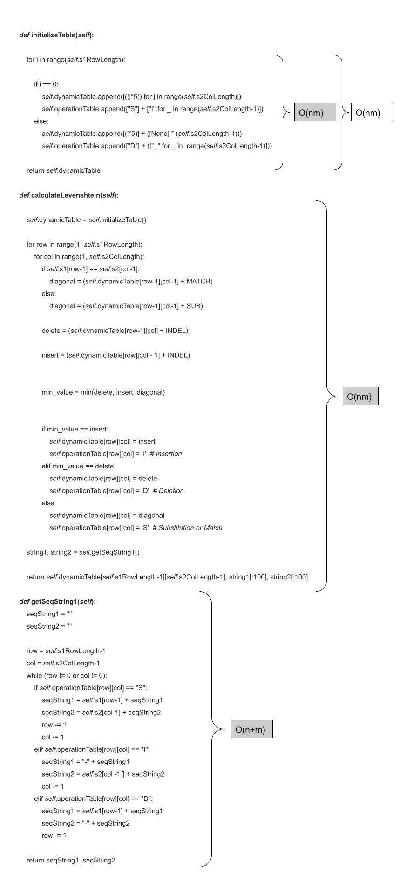
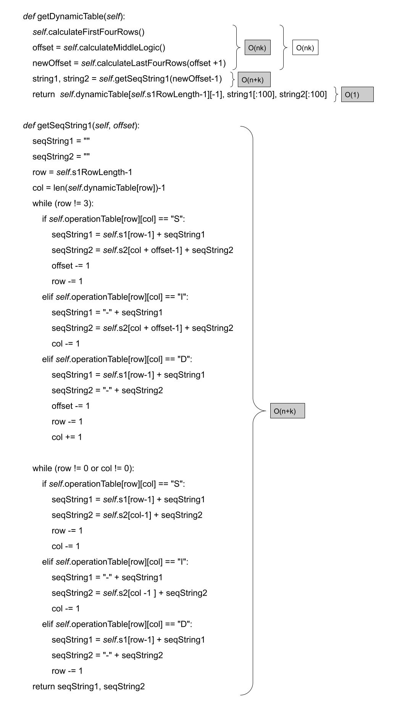
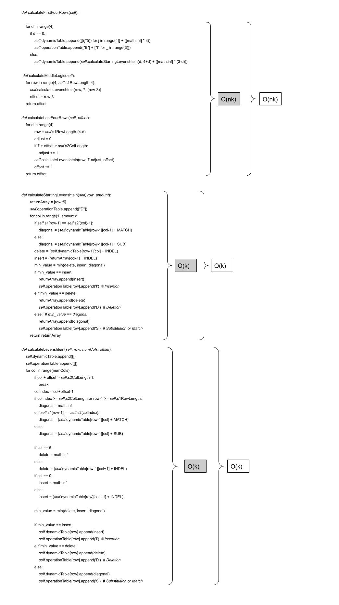

# Gene Sequencing (Dynamic Programming)

## 1 - Source Code
- [x] Include your commented source code for both your unrestricted and banded algorithms as an appendix.

### Unrestricted Algorithm Source Code

```
class UnrestrictedAlgorithm:

	def __init__ (self, MaxCharactersToAlign, sequence1, sequence2):
		self.s1RowLength = min(MaxCharactersToAlign+1, len(sequence1)+1)
		self.s2ColLength = min(MaxCharactersToAlign+1, len(sequence2)+1)
		self.s1 = sequence1
		self.s2 = sequence2
		self.dynamicTable = []
		self.operationTable = []
	
	def initializeTable(self):

		for i in range(self.s1RowLength):

			if i == 0:
				self.dynamicTable.append([((j*5)) for j in range(self.s2ColLength)])
				self.operationTable.append(["S"] + ["I" for _ in range(self.s2ColLength-1)])
			else:
				self.dynamicTable.append([(i*5)] + ([None] * (self.s2ColLength-1)))
				self.operationTable.append(["D"] + (["_" for _ in  range(self.s2ColLength-1)]))

		return self.dynamicTable
	
	def calculateLevenshtein(self):

		self.dynamicTable = self.initializeTable()

		for row in range(1, self.s1RowLength):
			for col in range(1, self.s2ColLength):
				if self.s1[row-1] == self.s2[col-1]:
					diagonal = (self.dynamicTable[row-1][col-1] + MATCH)
				else:
					diagonal = (self.dynamicTable[row-1][col-1] + SUB)

				delete = (self.dynamicTable[row-1][col] + INDEL)

				insert = (self.dynamicTable[row][col - 1] + INDEL)
				

				min_value = min(delete, insert, diagonal)


				if min_value == insert:
					self.dynamicTable[row][col] = insert
					self.operationTable[row][col] = 'I'  # Insertion
				elif min_value == delete:
					self.dynamicTable[row][col] = delete
					self.operationTable[row][col] = 'D'  # Deletion
				else: 
					self.dynamicTable[row][col] = diagonal
					self.operationTable[row][col] = 'S'  # Substitution or Match

		string1, string2 = self.getSeqString1()

		return self.dynamicTable[self.s1RowLength-1][self.s2ColLength-1], string1[:100], string2[:100]
	
	def getSeqString1(self):
		seqString1 = ""
		seqString2 = ""

		row = self.s1RowLength-1
		col = self.s2ColLength-1
		while (row != 0 or col != 0):
			if self.operationTable[row][col] == "S":
				seqString1 = self.s1[row-1] + seqString1
				seqString2 = self.s2[col-1] + seqString2
				row -= 1
				col -= 1
			elif self.operationTable[row][col] == "I":
				seqString1 = "-" + seqString1
				seqString2 = self.s2[col -1 ] + seqString2
				col -= 1
			elif self.operationTable[row][col] == "D":
				seqString1 = self.s1[row-1] + seqString1
				seqString2 = "-" + seqString2
				row -= 1

		return seqString1, seqString2

	def printTable(self):
		for row in range(self.s1RowLength):
			print(self.dynamicTable[row])
		print("above is the dynamic table^^")

		print("----------------------------------------------------------------------")
		for row in range(self.s1RowLength):
			print(self.operationTable[row])
		input("above is the operation table^^")
```

### Banded Algorithm Source Code

```
class BandedAlgorithm:

	def __init__ (self, MaxCharactersToAlign, sequence1, sequence2):
		self.s1 = sequence1
		self.s2 = sequence2
		self.s1RowLength = min(MaxCharactersToAlign+1, len(self.s1)+1)
		self.s2ColLength = min(MaxCharactersToAlign+1, len(self.s2)+1)
		self.dynamicTable = []
		self.operationTable = []
		return
	
	def calculateFirstFourRows(self):

		for d in range(4):
			if d == 0:
				self.dynamicTable.append([((j*5)) for j in range(4)] + ([math.inf] * 3))
				self.operationTable.append(["B"] + ["I" for _ in range(3)])
			else:
				self.dynamicTable.append(self.calculateStartingLevenshtein(d, 4+d) + ([math.inf] * (3-d)))

	
	def calculateMiddleLogic(self):

		for row in range(4, self.s1RowLength-4):
			self.calculateLevenshtein(row, 7, (row-3))
			offset = row-3
		
		return offset
	
	def calculateLastFourRows(self, offset):

		for d in range(4):
				row = self.s1RowLength-(4-d)
				adjust = 0
				if 7 + offset > self.s2ColLength:
					adjust += 1
				self.calculateLevenshtein(row, 7-adjust, offset)
				offset += 1

		return offset

	
	def calculateStartingLevenshtein(self, row, amount):
			returnArray = [row*5]
			self.operationTable.append(["D"])

			for col in range(1, amount):

				if self.s1[row-1] == self.s2[(col)-1]:
					diagonal = (self.dynamicTable[row-1][col-1] + MATCH)
				else:
					diagonal = (self.dynamicTable[row-1][col-1] + SUB)

				delete = (self.dynamicTable[row-1][col] + INDEL)

				insert = (returnArray[col-1] + INDEL)
				

				min_value = min(delete, insert, diagonal)

				if min_value == insert:
					returnArray.append(insert)
					self.operationTable[row].append('I')  # Insertion
				elif min_value == delete:
					returnArray.append(delete)
					self.operationTable[row].append('D')  # Deletion
				else:  # min_value == diagonal
					returnArray.append(diagonal)
					self.operationTable[row].append('S')  # Substitution or Match

			return returnArray

	def calculateLevenshtein(self, row, numCols, offset):
		self.dynamicTable.append([])
		self.operationTable.append([])

		for col in range(numCols):
				if col + offset > self.s2ColLength-1:
					break

				colIndex = col+offset-1

				if colIndex >= self.s2ColLength or row-1 >= self.s1RowLength:
					diagonal = math.inf
				elif self.s1[row-1] == self.s2[colIndex]:
					diagonal = (self.dynamicTable[row-1][col] + MATCH)
				else:
					diagonal = (self.dynamicTable[row-1][col] + SUB)

				if col == 6:
					delete = math.inf
				else:
					delete = (self.dynamicTable[row-1][col+1] + INDEL)
				if col == 0:
					insert = math.inf
				else:
					insert = (self.dynamicTable[row][col - 1] + INDEL)
				

				min_value = min(delete, insert, diagonal)


				if min_value == insert:
					self.dynamicTable[row].append(insert)
					self.operationTable[row].append('I')  # Insertion
				elif min_value == delete:
					self.dynamicTable[row].append(delete)
					self.operationTable[row].append('D')  # Deletion
				else: 
					self.dynamicTable[row].append(diagonal)
					self.operationTable[row].append('S')  # Substitution or Match

		return
	
	def getDynamicTable(self):
		self.calculateFirstFourRows()

		offset = self.calculateMiddleLogic()

		newOffset = self.calculateLastFourRows(offset +1)

		string1, string2 = self.getSeqString1(newOffset-1)
		return  self.dynamicTable[self.s1RowLength-1][-1], string1[:100], string2[:100]

	def getSeqString1(self, offset):
		seqString1 = ""
		seqString2 = ""

		row = self.s1RowLength-1
		col = len(self.dynamicTable[row])-1
		while (row != 3):
			if self.operationTable[row][col] == "S":
				seqString1 = self.s1[row-1] + seqString1
				seqString2 = self.s2[col + offset-1] + seqString2
				offset -= 1
				row -= 1
			elif self.operationTable[row][col] == "I":
				seqString1 = "-" + seqString1
				seqString2 = self.s2[col + offset-1] + seqString2
				col -= 1
			elif self.operationTable[row][col] == "D":
				seqString1 = self.s1[row-1] + seqString1
				seqString2 = "-" + seqString2
				offset -= 1
				row -= 1
				col += 1

		while (row != 0 or col != 0):
			if self.operationTable[row][col] == "S":
				seqString1 = self.s1[row-1] + seqString1
				seqString2 = self.s2[col-1] + seqString2
				row -= 1
				col -= 1
			elif self.operationTable[row][col] == "I":
				seqString1 = "-" + seqString1
				seqString2 = self.s2[col -1 ] + seqString2
				col -= 1
			elif self.operationTable[row][col] == "D":
				seqString1 = self.s1[row-1] + seqString1
				seqString2 = "-" + seqString2
				row -= 1


		return seqString1, seqString2
	
	def printTable(self):
		for row in range(len(self.dynamicTable)):
			print(self.dynamicTable[row])
		print("above is the dynamic table^^")

		print("----------------------------------------------------------------------")
		for row in range(len(self.operationTable)):
			print(self.operationTable[row])
		input("above is the operation table^^")
```

## 1 - Time and Space Complexity
- [x] Discuss the time and space complexity of both your algorithms.

The diagrams below indicate the time and space complexities of the Unrestricted and Banded Algorithms. The overall Time and Space Complexity of the Unrestricted Algorithm is O(nm), while the overall Time and Space Complexity of the Banded Algorithm is O(kn), k being 7 in this case. 

Legend:

- Grey Labels - Time Complexity
- White Labels - Space Complexity

### Unrestricted Algorithm

This algorithm first initializes the whole table, calculates the numbers for the whole table, and then backtacks on the operationTable to get the final sequence.



### Banded Algorithm

This algorithm is split up into three functions; calculateFirstFourRows, calculateMiddleLogic and calculateLastFourRows. You can see the function calls to these functions and how they populate the table in the second picture. The first picture displays the function which calls all the individual parts, along with the function that backtracks the operationTable to get the final sequence. 

The dependency pointers had to be changed in the getSeqString() function to adjust for the differences in the first four rows, as substitute, match and delete are one column to the right for the rest of the rows. The first four rows share the same logic as the unrestricted algorithm, and have to jump between the two approaches to find the final edit distance and sequence strings. 





## 1 - Screenshots

- [x] Include 2 screen-shots of the given examples.

### Unrestricted Matrix Example


### Banded Matrix Example


## 1 - Example Alignment
- [x] Include the alignment for the first 100 characters of sequences #3 and #10

### Unrestricted Sequence Comparison


### Banded Sequence Comparison


