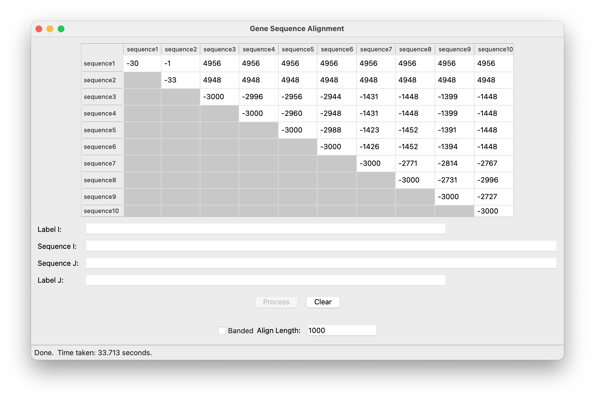
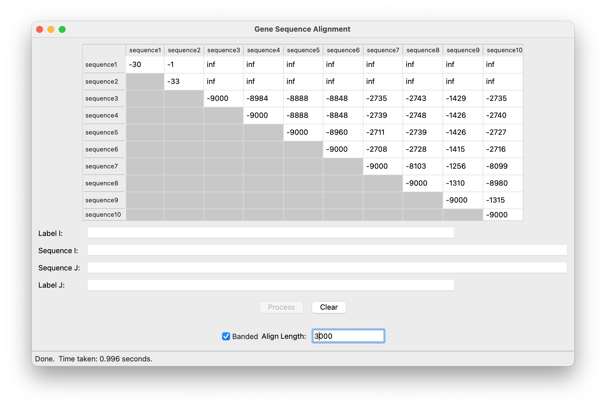
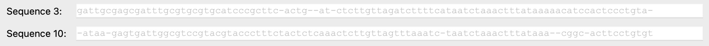
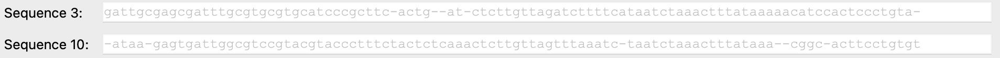

# Gene Sequencing (Dynamic Programming)

## 1 - Source Code
- [x] Include your commented source code for both your unrestricted and banded algorithms as an appendix.

### Unrestricted Algorithm Source Code

```

```

### Banded Algorithm Source Code

```

```

## 1 - Time and Space Complexity
- [x] Discuss the time and space complexity of both your algorithms.

## 1 - Screenshots
- [x] Include 2 screen-shots of the given examples.

### Unrestricted Matrix Example



### Banded Matrix Example



## 1 - Example Alignment
- [x] Include the alignment for the first 100 characters of sequences #3 and #10

### Unrestricted Sequence Comparison



### Banded Sequence Comparison


