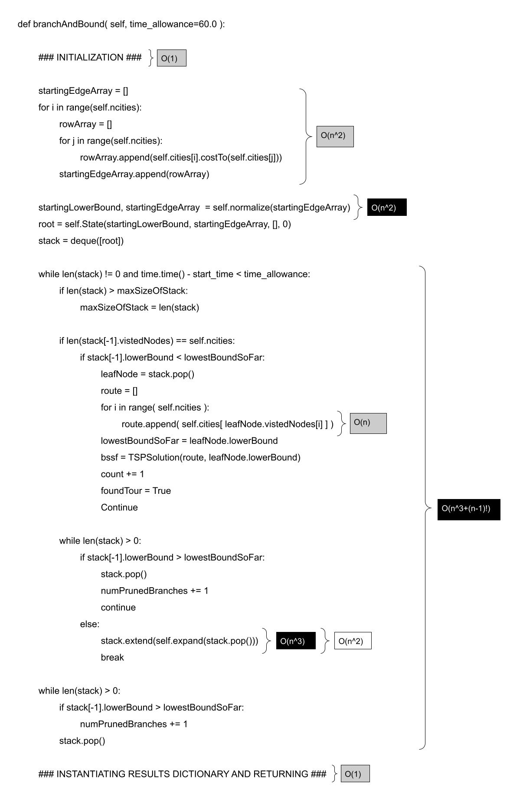

# Travelling Salesperson (Branch and Bound)

## 1 - Code for Greedy and Branch and Bound Algorithms
- [x] Include your self-documenting code for both greedy and branch and bound.

```
	def greedy( self,time_allowance=60.0 ):
		results = {}
		cities = self._scenario.getCities()
		ncities = len(cities)
		foundTour = False
		best_cost = np.inf
		best_solution = None
		count = 0
		start_time = time.time()

		while not foundTour and time.time() - start_time < time_allowance:
			for start_index in range(ncities):
				visited = [False] * ncities
				route = []
				totalEdgeCost = 0
				currCity = cities[start_index]
				visited[start_index] = True
				route.append(currCity)

				for _ in range(ncities - 1):
					nextCity = None
					minCost = np.inf
					
					# Find the nearest unvisited city
					for i in range(ncities):
						if not visited[i]:
							cost = currCity.costTo(cities[i])
							if cost < minCost:
								minCost = cost
								nextCity = cities[i]
					
					# Move to the nearest city
					if nextCity is None:
						# if the last node is a sink (has no leaving edges) 
						totalEdgeCost = np.inf
						break
					route.append(nextCity)
					totalEdgeCost += minCost
					visited[cities.index(nextCity)] = True
					currCity = nextCity

				# Create the solution object
				if totalEdgeCost < best_cost:
					best_cost = totalEdgeCost
					best_solution = TSPSolution(route)

				count += 1

		
				if time.time() - start_time >= time_allowance:
					break

			foundTour = best_solution is not None

		end_time = time.time()

		results['cost'] = best_cost if best_solution is not None else math.inf
		results['time'] = end_time - start_time
		results['soln'] = best_solution
		results['count'] = count
		results['max'] = None # This is supposed to be the max size of the queue
		results['total'] = None # this is the total number of nodes created?
		results['pruned'] = None # this is the number of pruned branches
		return results
```
```
	def branchAndBound( self, time_allowance=60.0 ):
		### INITIALIZATION ###
		results = {}
		self.cities = self._scenario.getCities()
		self.ncities = len(self.cities)
		maxSizeOfStack = 1
		numPrunedBranches = 0
		self.numNodes = 1
		start_time = time.time()

		startingEdgeArray = []
		for i in range(self.ncities):
			rowArray = []
			for j in range(self.ncities):
				rowArray.append(self.cities[i].costTo(self.cities[j]))
			
			startingEdgeArray.append(rowArray)

		startingLowerBound, startingEdgeArray  = self.normalize(startingEdgeArray)
		root = self.State(startingLowerBound, startingEdgeArray, [], 0)

		stack = deque([root])

		foundTour = False
		count = 0
		bssf = None
		lowestBoundSoFar = np.inf
		### INITIALIZATION ###

		# Branch and Bound algorithm #
		while len(stack) != 0 and time.time() - start_time < time_allowance: 
			if len(stack) > maxSizeOfStack:
				maxSizeOfStack = len(stack)

			# if a table is filled, see if its lowerbound is lower than the lowest so far and make it your best solution
			if len(stack[-1].vistedNodes) == self.ncities:
				if stack[-1].lowerBound < lowestBoundSoFar:
					leafNode = stack.pop()

					route = []
					for i in range( self.ncities ):
						route.append( self.cities[ leafNode.vistedNodes[i] ] )

					lowestBoundSoFar = leafNode.lowerBound
					bssf = TSPSolution(route, leafNode.lowerBound)
					count += 1
					foundTour = True
					continue

			# if the lowerbound of the top state is less than the previous lowest bound so far, then we continue. if it is above, then we can simply pop it off and continue
			# if the lower bound is negative, then you can pop it off becuase it is crossing lines somewhere
			while len(stack) > 0: # this while loop may be unneccessary, but I think the time complexity is slightly faster because you don't have the if statmenet above in it as well? may be negligible.
				if stack[-1].lowerBound > lowestBoundSoFar:
					stack.pop()
					numPrunedBranches += 1
					continue
				else:
					stack.extend(self.expand(stack.pop()))
					break

		while len(stack) > 0: 
			if stack[-1].lowerBound > lowestBoundSoFar:
				numPrunedBranches += 1
			stack.pop()
			
		# Branch and Bound Algorithm

		# Population results with the solution. this is outside the Branch and Bound algorithm #
		end_time = time.time()
		results['cost'] = bssf.cost if foundTour else math.inf
		results['time'] = end_time - start_time
		results['count'] = count
		results['soln'] = bssf
		results['max'] = maxSizeOfStack # This is supposed to be the max size of the queue
		results['total'] = self.numNodes # this is the total number of nodes created?
		results['pruned'] = numPrunedBranches # this is the number of pruned branches
		return results

	class State:
		# State object made to hold the values of each state for comparing state together. 
		def __init__(self, lowerBound, edgeArray, vistedNodes, lastNode):
			self.vistedNodes = vistedNodes
			self.vistedNodes.append(lastNode)
			self.lowerBound = lowerBound
			self.edgeArray = edgeArray
			self.lastNode = lastNode


	# This should return an ordered list of state objects (reverse ordered with the last being the smallest lower bound) which are extended onto the stack. 
	def expand(self, parentState):

		numChildStates = len(parentState.edgeArray[0]) - len(parentState.vistedNodes)
		self.numNodes += numChildStates 

		listOfStates = []
		for col in range(self.ncities):
			# if the edge to a certain node is infinity or has already been visted
			if col in parentState.vistedNodes or parentState.edgeArray[parentState.lastNode][col] == np.inf:
				continue
			# copy the parents edgeArray for each child state
			childEdgeArray = [row[:] for row in parentState.edgeArray]

			# get the preliminary lower bound of this state
			childLowerBound = parentState.lowerBound + childEdgeArray[parentState.lastNode][col]

			#  set everything on the row and col equal to infinity, as well as the back edge
			for i in range(self.ncities):
				childEdgeArray[parentState.lastNode][i] = np.inf
				childEdgeArray[i][col] = np.inf
			childEdgeArray[col][parentState.lastNode] = np.inf

			# normalize the child array
			lowerBoundAdditional, childEdgeArray = self.normalize(childEdgeArray)

			# add the child state to a list of all child states
			listOfStates.append(self.State((childLowerBound + lowerBoundAdditional), childEdgeArray, parentState.vistedNodes[:], col))

		if len(listOfStates) != 0:
			# could just return here
			return sorted(listOfStates, key=lambda state: state.lowerBound, reverse=True)
		else:
			# could just return here
			return listOfStates


	# this function is used for Debugging purposes. It just prints out the 2d state arrays in a format that is easily readable. 
	def printEdgeArray(self, startingEdgeArray):

    # Determine the maximum width needed for each entry

		# Format string for printing
		format_str = f"{{:<{4}}}"

		# Print the edge array
		for i in range(self.ncities):
			printString = ''
			for j in range(self.ncities):
				value = startingEdgeArray[i][j]
				if np.isinf(value):
					value_str = "inf"
				else:
					value_str = str(int(value))  # Convert to string, truncate to integer if needed
				printString += format_str.format(value_str) + " | "
			
			print('| ' + printString) 

		input("^ - - edge array - - ^ ")

	# This function subtracts all columns and rows by their lowest value and returns the new lowerBound
	def normalize(self, edgeArray):
		lowerBound = 0
		minForCol = edgeArray[0][:]
		for i in range(self.ncities):
			lowestLeavingEdge = min(edgeArray[i])
			if np.isinf(lowestLeavingEdge):
				continue

			lowerBound += lowestLeavingEdge

			for j in range(self.ncities):
				
				# this is for skipping a row if it is infinity or zero
				if edgeArray[i][j] == 0:
					minForCol[j] = edgeArray[i][j]
					continue

				# this if for subtracting everything by the min of the row
				edgeArray[i][j] = (edgeArray[i][j] - lowestLeavingEdge)

				# this is for finding the smallest value in the col
				if edgeArray[i][j] < minForCol[j]:
					minForCol[j] = edgeArray[i][j]

		# this is for subtracting columns by their lowest amount
		for i in range(self.ncities):

			if minForCol[i] != 0 and not np.isinf(minForCol[i]):
				lowerBound += minForCol[i]

			for j in range(self.ncities):
				if minForCol[j] == np.inf or minForCol[j] == 0:
					continue
				edgeArray[i][j] = (edgeArray[i][j] - minForCol[j])

		return lowerBound, edgeArray

```

      
## 2 - Time and Space Complexity
- [x] Discuss the time and space complexity of your algorithms.

Below are the different sections discussing the Time and Space Complexity of various aspects of the code. If a line of code is not specified, you can assume it has constant time and space complexity. For all other cases, the following legend is applicable.

Legend:
- White -> Space Complexity
- Gray -> Time and Space Complexity
- Black -> Time Complexity

### Greedy Algorithm

Time Complexity = O(Tn^3) - The Time Complexity is atmost O(Tn^3) where T is the time allowance. In reality, the Time Complexity will be much smaller on average as the while loop and largest for loop only iterate if it fails to find a path, which in this situation happens fairly infrequently. 

Space Complexity = O(n) - You just need to populate the route and visted arrays, which are of length n. 

<p align="center">

</p>

### Priority Data Structure

**Time Complexity** = O(1) - Becuase I used a stack instead of a queue (see discussion under 4 - Priority Data Structure), initialization, insertion and deletion complexity are all O(1).

**Space Complexity** = O(((n-1)n)/2) - Worst case scenario, the stack could hold O(((n-1)n)/2) number of states at one time (all of the states generated at each level if you only ever follow one of the generated branches. See Space Complexityy of BSSF initialization for more info), though in reality it is much less than this. 

### Reduced Cost Matrix

**Time Complexity** = O(n^2) - You need to iterate over each entry in the 2d array twice, which is 2n^2. 

**Space Complexity** = O(n^2) - Filling each entry in the n by n array is n^2

### BSSF Initialization

**Time Complexity** = O(((n-1)n)/2) - I initialize the BSSF to infinity and only change it once I reach the first leaf node. However, if you consider initialization as when I find the first bssf other than infinity, it would be found by generating all the child nodes for only one of the possible branches. See Space Complexity.

**Space Complexity** = O(((n-1)n)/2) - Worse case scenario would be you have to fill all the child nodes for only one of the branches at each iteration. This would result in n-1 + n-2 + n-3+ n-4 ... + 1 which simplifies down to ((n-1)n)/2

### Expand Function

**Time Complexity** = O(n^3) - To populate the child state arrays, you need to make n-1 passes which are each n^2. See Space Complexity.

**Space Complexity** = O(n^3) - You create a n by n matrix for each child state. Because there can be at most n-1 child states, the Space Complexity could be at worst O(n^3) 

### Branch and Bound Algorithm

**Time Complexity** = O((n-1)!) - This is because there are n-1! nodes on the full tree. Each node takes n^3 time to expand, but that is swallowed up in the amount of nodes you need to generate

**Space Complexity** = O((n-1)!) - this is for the same reason the time complexity is n-1!


Branch and Bound Helper Functions:
<p align="center">

</p>

 Branch and Bound Overview:
<p align="center">

</p>

## 3 - State Data Structure
- [x] Describe the data structures you used to represent the states.

I created a State object which held the reduced cost matrix that it took to get to the current location. I had to create a state object so that it could remeber the last visted node (used in expansion), all visted nodes so far (also used in expansion) as well as the lower bound of each state. Becuase I was doing a depth first search using a stack, I had to remember the lower bound when the state was created. 

## 4 - Priority Data Structure
- [x] Describe the priority data structure you use and how it works. 

I used a stack priority structure so that I could do a depth first search. I would always add new states onto the stack such that the state with the lowest bound would be first to be popped off. This would result in an inital BSSF that was a good enough guess to prune off many states after this. This approach is similar to the Path Finder Algorithm discussed in class. 

## 5 - Initial BSSF
- [x] Describe your approach for the initial BSSF.

I did a depth first search following the state with the lowest bound. This would mean that my initial BSSF was fairly low for this situation, and I could prune off many states after the fact. 

## 6 - Data Table
- [x] Include a table containing the specified columns.

| # of Cities |  Seed  | Running Time (Sec) | Cost of Best Tour Found | Max # of Stored States at a Given Time | # of BSSF updates | Total # of states created | Total # of States Pruned | Running Time for Greedy | Tour Cost for Greedy |
|-------------|--------|--------------------|-------------------------|----------------------------------------|-------------------|---------------------------|--------------------------|-------------------------|----------------------|
|   15        |   20   |      0.944         |         10,534          |                 72                     |        19         |           11,942          |           8,369          |          0.003          |        9,871         |    
|   16        |   902  |      2.698         |         7,954           |                 82                     |         8         |           31,735          |          22,005          |          0.004          |        9,978         |    
|   17        |   54   |     16.382         |         9,280           |                 98                     |        12         |          178,318          |          123,978         |          0.005          |       11,010         |    
|   18        |   416  |      7.247         |         8,841           |                109                     |        12         |           70,880          |           50,375         |          0.006          |        9,463         |    
|   19        |    38  |     60.000         |         10,069          |                121                     |        4          |          550,294          |          388,630         |          0.007          |        9,466         |    
|   20        |   758  |     60.001         |         10,577          |                143                     |        8          |          516,676          |          363,411         |          0.008          |       11,810         |    
|   25        |   523  |     60.002         |         13,808          |                220                     |        8          |          403,334          |          274,234         |          0.015          |       15,183         |    
|   30        |    82  |     60.004         |         13,599          |                329                     |        8          |          288,038          |          210,041         |          0.023          |       16,068         |    
|   40        |   615  |     60.012         |         17,979          |                605                     |        6          |          259,242          |          144,716         |          0.051          |       18,365         |  
|   50        |   854  |     60.024         |         19,258          |                920                     |        3          |          155,055          |          108,168         |          0.086          |       22,448         | 

## 7 - Experimental Results
- [x] Discuss the results in the table and why you think the numbers are what they are.

The only columns with significant dependent results are in columns 4 - 7. 

(col 4) It makes sense that the max number of stored states at a given time increases as the tree sizes increases. 

(col 5) It makes sense that there are less bssf updates as the tree gets bigger becuase it is harder to get to all leaf nodes when the tree is bigger. Once they reach 60 seconds to traverse, many of the potential bssf updates simply cannot be reached in time. 

(col 6) Number of states created seems to follow a bell curve of sorts which starts lower, goes high in the middle and goes down at the end. I believe this is because larger n values will slow down the time it takes to traverse the n by n arrays, leaving  less time to visit other states in general. that explains why it is lower at the end, and the smaller number of states at the bigginnning is simply due to the smaller number of nodes in the tree. It seems the optimal time to traverse those arrays as well as traverse the tree is around 19 cities. 

(col 7) This follows the same pattern as the states created. 

As the time it takes to run the branch and bound algorithm increases (assuming no cutoff time) it becomes more and more worth it to use the greedy algorithm as it solves much faster and gets pretty close to the solution. 

## 8 - Branch and Bound Methodology
- [x] Discuss the mechanisms you tried and how effective they were in getting the state space search to dig deeper and find more solutions early.

I used the path finder approach discussed in class to do a depth first search on what appears to be the lowest bound so far, and then use the lowerbound from that leaf node to prune off all the states larger than that. While my time and space complexity may have a larger worst case scenario, the average is fairly quicker. One way I was able to speed up my algorithm was I never bothered to generate any state that required taking an edge of infinite length to get there. That was able to speed up the expansion function by a lot as you go farther down the tree. 


